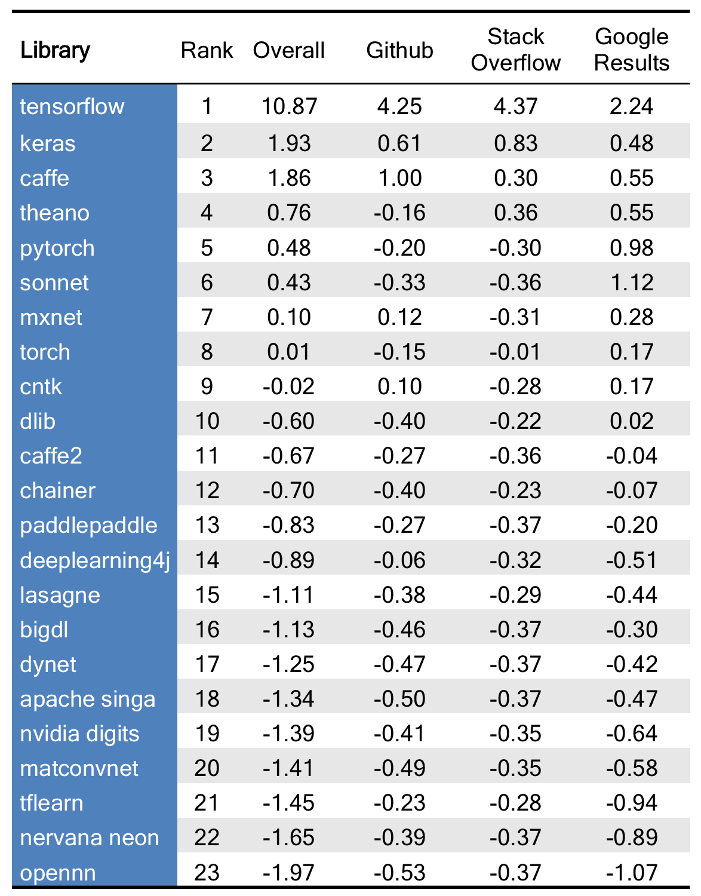
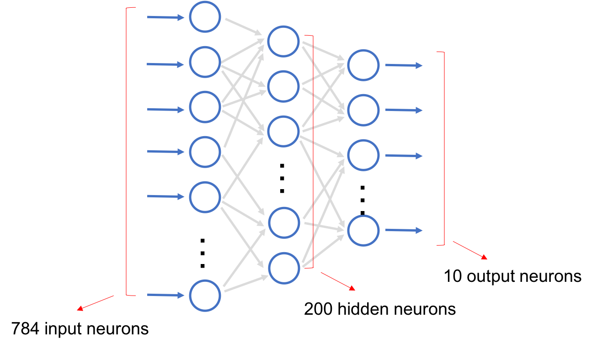
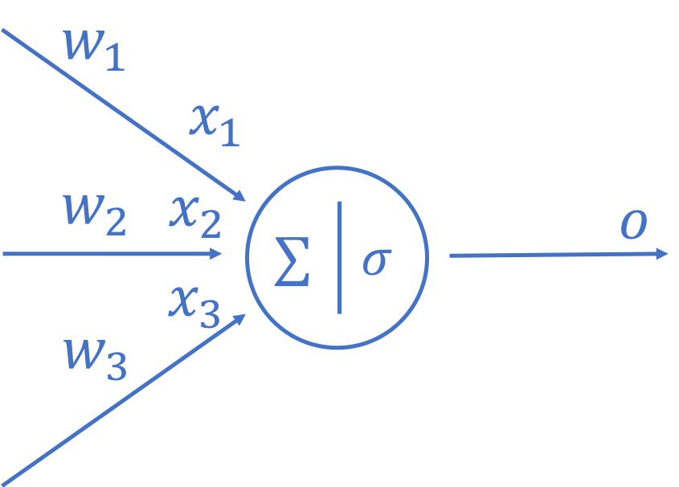
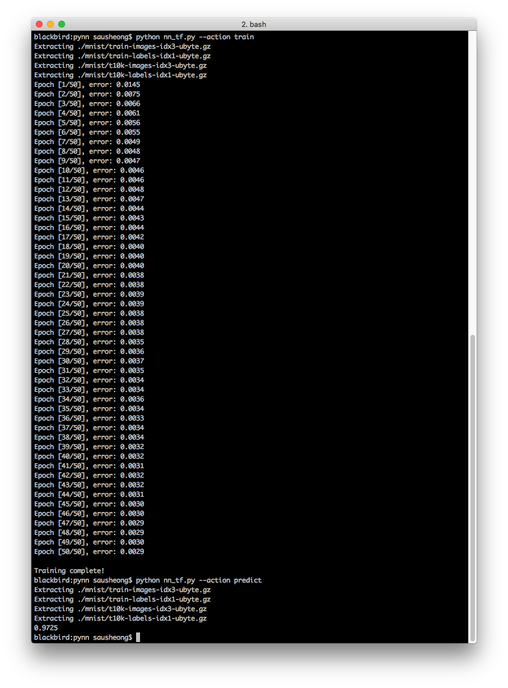
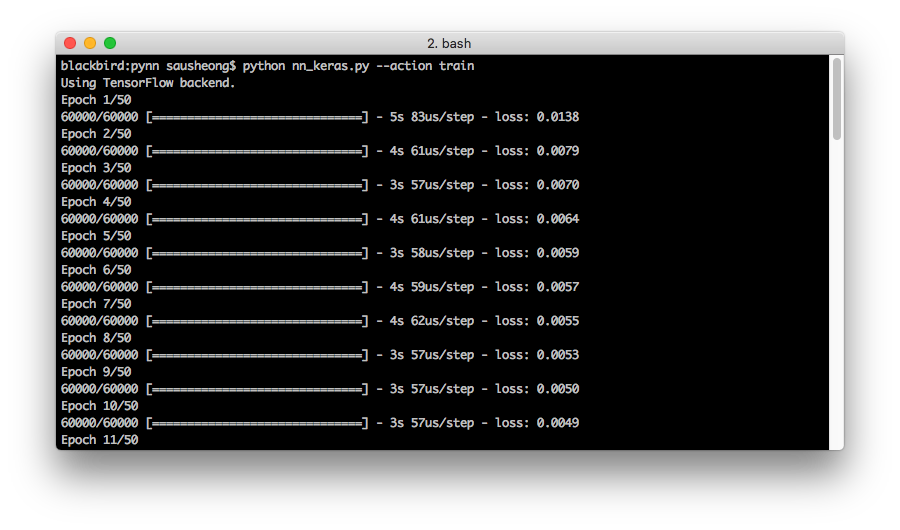
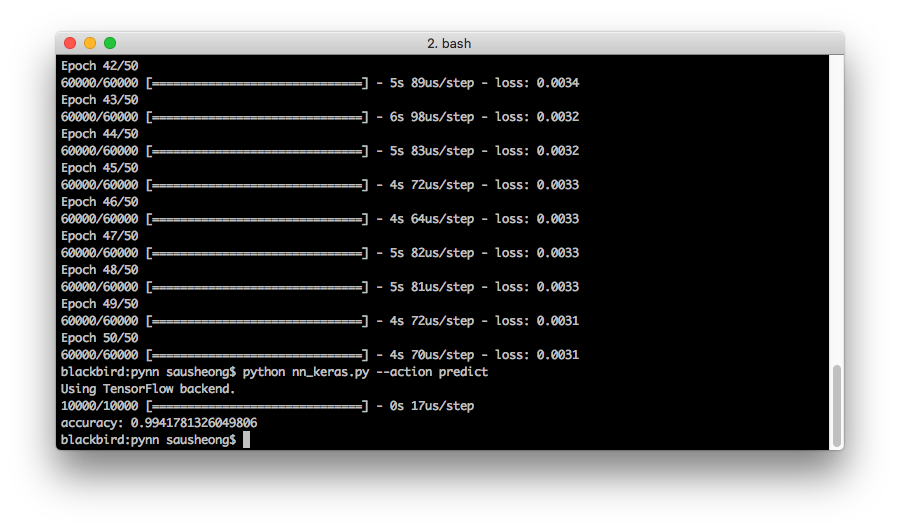
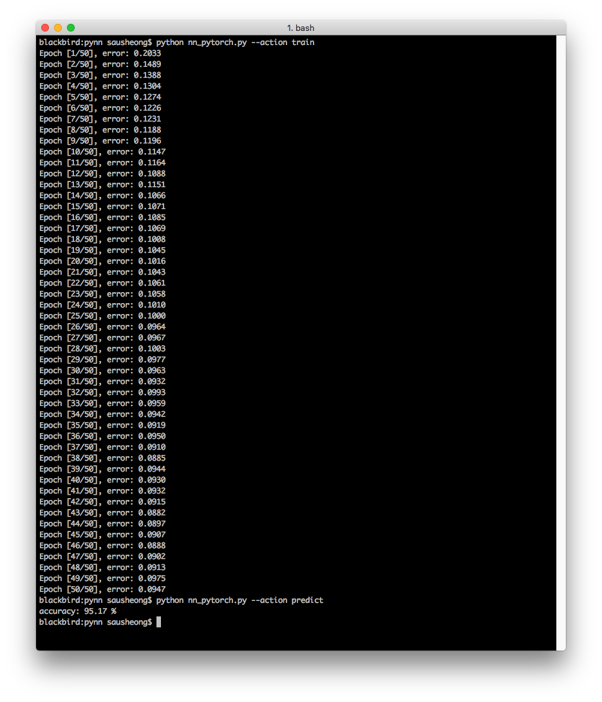
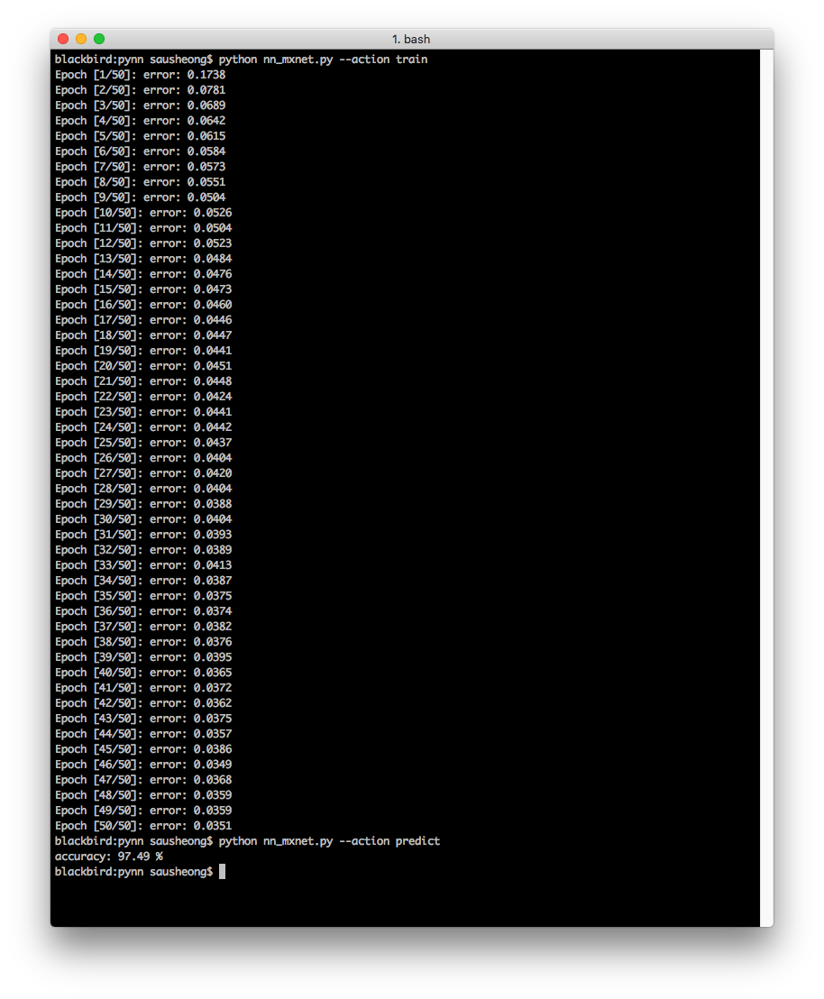

# # Building simple artificial neural networks with TensorFlow, Keras, PyTorch and MXNet/Gluon

A few weeks ago I [went through the steps of building a very simple neural network](https://sausheong.github.io/posts/how-to-build-a-simple-artificial-neural-network-with-go/) and implemented it from scratch in Go. However there are many deep learning frameworks that are already available, so doing it from scratch isn't normally what you'll do if you want to use deep learning as a tool to solve problems.

The question is with the many that deep learning frameworks, which one should I use? There are many ways to compare deep learning frameworks. Here’s a relatively recent (September 2017) [ranking by Data Incubator]([data-science-blogs/deep-learning-libraries.md at master · thedataincubator/data-science-blogs · GitHub](https://github.com/thedataincubator/data-science-blogs/raw/master/deep-learning-libraries.md)) that gives an interesting popularity ranking based on their Github, Stack Overflow and Google search results scores.



From the results, it’s quite clear that TensorFlow is easily the most popular framework and with Keras now being a part of TensorFlow itself, things won’t change much in the near future. Also, almost all popular deep learning frameworks have Python APIs, so a combination of TensorFlow/Keras with Python seems the way to go.

Nonetheless, I was curious about some of the other frameworks and so I began a mini-journey to write the same (or almost the same) simple artificial neural network I did in a few of these frameworks for comparison.

As a quick refresher, the neural network I created was a simple feed-forward neural network, also commonly called a multi-level perceptron (MLP). Using this simple MLP, I took the MNIST dataset of 60,000 handwritten digits and trained the neural network with it. After that I used the test dataset of 10,000 handwritten digits to test the accuracy of the neural network.



The neural network had 3 layers, the first (input) layer has 784 neurons (28 x 28 pixels), the second (hidden) layer has 200 neurons and the final (output) layer has 10 neurons. I used the sigmoid function as the activation function, and also mean square error as the loss function. Finally, I used 0.1 as the learning rate and didn’t use any bias neurons at all.

All the implementations below follow the same generic steps:

1. Set up the parameters and load the datasets (most frameworks have a means to load standard datasets like MNIST)
2. Define the neural network by creating a `mlp` function that creates and returns the neural network
3. Define the `train` function
4. Define the `predict` function
5. Create a main that allows the user to first train using the training dataset (60,000 images) then predict using the test dataset (10,000 images)

This handwriting recognition of digits with the MNIST dataset is so often used in deep learning tutorials it's almost the 'hello world' of writing deep learning programs. As a disclaimer though, the implementations you see below are not optimized in any way and are not the definitive way of doing it. In fact there are many other more optimal ways of doing it, these are just a few.

Now let's start and see how to implement this in TensorFlow first.

# TensorFlow
TensorFlow was originally developed by researchers and engineers who worked on the Google Brain project for internal use, and open sourced in 2015. It’s the most popular deep learning framework to date by far.

Amongst the more famous projects that are running on TensorFlow includes [DeepMind]([DeepMind](https://deepmind.com/)) (the Google-owned company that developed AlphaGo), which [converted from Torch to TensorFlow in 2016]([Research Blog: DeepMind moves to TensorFlow](https://research.googleblog.com/2016/04/deepmind-moves-to-tensorflow.html)).

This implementation uses TensorFlow 1.6. Let’s start.

## Set up parameters and load the dataset
``` python
import TensorFlow as tf
import argparse
import numpy as np
from TensorFlow.examples.tutorials.mnist import input_data

# parameters
inputs, hiddens, outputs = 784, 200, 10
learning_rate = 0.01
epochs = 50
batch_size = 20

#loading the datasets
mnist = input_data.read_data_sets("./mnist/", one_hot=True)
```

The is rather simple and self explanatory. Note that we’re setting up the data output to be [one-hot]([One-hot - Wikipedia](https://en.wikipedia.org/wiki/One-hot)). This just means the position of the ndarray element with the highest value is the correct one.

## Define the neural network
``` python
# a random generator using uniform
def random(r, c, v):
    return tf.random_uniform([r,c], minval=-1/tf.sqrt(float(v)), maxval=1/tf.sqrt(float(v)))

# the neural network
def mlp(x, hidden_weights=None, output_weights=None):
    if hidden_weights == None:
        hidden_weights = tf.Variable(random(inputs, hiddens, inputs), name="hidden_weights")
    if output_weights == None:
        output_weights = tf.Variable(random(hiddens, outputs, hiddens), name="output_weights")
    hidden_outputs = tf.matmul(x, hidden_weights)
    hidden_outputs = tf.nn.sigmoid(hidden_outputs)  
    final_outputs = tf.matmul(hidden_outputs, output_weights)
    final_outputs = tf.nn.sigmoid(final_outputs)
    return final_outputs
```

This is where we define the neural network.  It’s relatively straightforward. If the hidden and output weights are not passed in, the weights are randomly generated using the `tf.random_uniform` function.  This happens when we train the neural network.



As in [the previous neural network I created](https://sausheong.github.io/posts/how-to-build-a-simple-artificial-neural-network-with-go/), we first multiply (using `tf.matmul`) the input `x` with the hidden weights to get the hidden outputs .  Remember we’re working with matrices so `tf.matmul` is actually a dot product function and the hidden weights and the inputs are both matrices.

The hidden outputs are then passed through an activation function, in this case a `sigmoid` function.  The output is then multiplied with the output weight to get the final outputs. 

The final outputs are returned after they have been passed through a sigmoid activation function again.

## Define the train function
``` python
# training with the train dataset
def train(x, y):
    final_outputs = mlp(x)
    errors = tf.reduce_mean(tf.squared_difference(final_outputs, y))
    optimiser = tf.train.AdamOptimizer(learning_rate=learning_rate).minimize(errors)
    init_op = tf.global_variables_initializer()
    saver = tf.train.Saver()
    with tf.Session() as sess:
        sess.run(init_op)
        total_batch = int(len(mnist.train.labels) / batch_size)
        for epoch in range(epochs):
            avg_error = 0
            for i in range(total_batch):
                batch_x, batch_y = mnist.train.next_batch(batch_size=batch_size)
                _, c = sess.run([optimiser, errors], feed_dict={x: batch_x, y: batch_y})
                avg_error += c / total_batch
            print("Epoch [%d/%d], error: %.4f" %(epoch+1, epochs, avg_error))
        print("\nTraining complete!")
        saver.save(sess, "./model")
```

Let’s look at how we train our neural network model. First, we create it using the `mlp` function, passing it the inputs. We also define our error function aptly named `error` to be the squared difference between the target and the output (mean square error). 

Next, we define the optimizer, and we use the [Adam]([Everything you need to know about Adam Optimizer – Nishant Nikhil – Medium](https://medium.com/@nishantnikhil/adam-optimizer-notes-ddac4fd7218)) optimizer here, passing it the learning rate and also our error function. When I first started dabbling with this, I used the gradient descent optimizer but the values take a very long time to converge. When when I switched over to the Adam optimizer it converged nicely so I used the Adam optimizer instead.  

Now that we have our optimizer, we initialise all the variables and define a saver so that we can save the model. We start a session and run the mini-batches by epochs, passing it the training dataset we loaded earlier on.

Once we’re done with the training, we save the model.  A TensorFlow model consists of two parts. The first is the meta graph, which saves information on the TensorFlow graph. This is saved into a file with a `.meta` extension, in this case, it will be `model.meta`.

The second are a bunch of checkpoint files. The `model.index` stores a list of variable names and shapes, while the `model.data-00000-of-00001` stores the actual values of the variables. 

We’ll be re-using these files later when we want to load the model for doing the prediction.

## Define the predict function
``` python    
# predicting with the test dataset
def predict(x):    
    saver = tf.train.import_meta_graph("./model.meta")
    with tf.Session() as sess:
        saver.restore(sess, tf.train.latest_checkpoint("./"))
        graph = tf.get_default_graph()
        hidden_weights = graph.get_tensor_by_name("hidden_weights:0")
        output_weights = graph.get_tensor_by_name("output_weights:0")
        final_outputs = mlp(x, hidden_weights, output_weights)       
        correct_prediction = tf.equal(tf.argmax(y, 1), tf.argmax(final_outputs, 1))
        accuracy = tf.reduce_mean(tf.cast(correct_prediction, tf.float32))
        tf.summary.scalar('accuracy', accuracy)          
        print(sess.run(accuracy, feed_dict={x: mnist.test.images, y: mnist.test.labels}))
```

After we’ve trained the model we would want to have something that we can use for predicting the values. In this case what we actually want is to run our `predict` function over the 10,000 images in the test dataset and see how many of them our trained model gets correctly.

We start off with importing the meta graph, which is from the `model.meta` file. Next we restore the checkpoint and use the default graph to get the hidden weights and output weights by their respective names. 

Finally we restore the trained model by calling the `mlp` function and passing it the saved weights.

Armed with the trained model, we try to predict output as we pass in the test dataset, and get the accuracy of the model. The `predict` function prints out the accuracy of the prediction of all the test images.


## Training then predicting
```python
if __name__ == "__main__":
    x = tf.placeholder(tf.float32, [None, inputs])
    y = tf.placeholder(tf.float32, [None, outputs])       
    parser = argparse.ArgumentParser()
    parser.add_argument("--action", type=str, default="predict" )
    FLAGS, unparsed = parser.parse_known_args()
    if FLAGS.action == "predict":
        predict(x)
    if FLAGS.action == "train":
        train(x, y)
```

The last bit is pretty trivial, it’s just a main function that allows the user to either predict or train according. This part is actually the same in the other implementations so I won’t be showing this code again later on. 

Here’s the results.



The model predicts correctly 97.25% of the time, which is not too good but ok. Now let’s look at Keras next.

# Keras (on TensorFlow)
Keras isn’t a separate framework but an interface built on top of TensorFlow, Theano and CNTK. Keras is designed for fast prototyping and being easy to use and user-friendly. 

In 2017, TensorFlow decided to [support Keras in TensorFlow’s core library]([Big deep learning news: Google TensorFlow chooses Keras · fast.ai](http://www.fast.ai/2017/01/03/keras/)) though nothing changed for Keras itself. 

Let’s see how things are different in Keras.

## Set up parameters and load the dataset
``` python
import argparse
from keras.models import Sequential
from keras.datasets import mnist
from keras.layers import Dense
from keras.models import load_model
from keras import optimizers
from keras import utils

# parameters
inputs, hiddens, outputs = 784, 100, 10
learning_rate = 0.01
epochs = 50
batch_size = 20

# loading datasets
(train_images, train_labels), (test_images, test_labels) = mnist.load_data()
train_images = train_images.reshape(60000, 784).astype('float32')/255
train_labels = utils.to_categorical(train_labels, outputs)
test_images = test_images.reshape(10000, 784).astype('float32')/255
test_labels = utils.to_categorical(test_labels, outputs)
```

Setting up the dataset seems a bit more elaborate than before but it’s not a big deal, in fact it’s clearer that we’re reshaping the train and test datasets to the correct shapes and sizes.

## Define the train function
```python
# training with the train dataset
def train():
    model = Sequential()
    model.add(Dense(hiddens, activation='sigmoid', input_shape=(inputs,)))
    model.add(Dense(outputs, activation='sigmoid'))
    sgd = optimizers.Adam(lr=learning_rate)
    model.compile(optimizer=sgd, loss='mean_squared_error')
    model.fit(train_images, train_labels, batch_size=batch_size, epochs=epochs)
    model.save('mlp_model.h5')
```

You might notice that I didn’t define the neural network here. I could have created a separate `mlp` function to do that but it’s not really necessary because I used one of the built-in Keras models called `Sequential` and simply stacked layers on top of it to build the network.

The first two lines added the hidden and output layers (the input later is assumed by default, given the input shape of the hidden layer). This includes the activation function `sigmoid`.

We define the optimizer next, using `optimizers.Adam` which is the built-in Adam optimizer. 

The model is compiled with the optimizer, and assigned an error (or loss) function `mean_squared_error` which is also built-in.

Finally we use the `fit` method to train the model using the images and labels, with the given batch size and number of epochs. 

As before, we save the model after training it.

## Define the predict function
```python
# predicting the test dataset
def predict():
    model = load_model("mlp_model.h5")
    error = model.evaluate(test_images, test_labels)
    print("accuracy:", 1 - error)
```

If you think the training function was rather simple, check out the predict function! You simply need to load up the model, then use it to evaluate the test images and labels!

## Training then predicting
Here’s what you see when training.




And here’s the results when predicting.




The accuracy here is much better, we have 99.42% accuracy in detecting the correct images.  

# PyTorch
[PyTorch]([PyTorch](http://pytorch.org/)), as the name suggests, is the Python version of the Torch framework. Torch was originally developed in C, with a wrapper using the Lua programming language.  PyTorch is primarily developed by Facebook’s AI research group, and wraps around the Torch binaries with Python instead.

A key feature in PyTorch is the ability to modify existing neural networks without having to rebuild it from scratch, using dynamic computation graphs. PyTorch describes it like using and replaying a tape recorder and it’s inspired by other works such as [autograd]([GitHub - HIPS/autograd: Efficiently computes derivatives of numpy code.](https://github.com/HIPS/autograd)) and [Chainer]([Chainer: A flexible framework for neural networks](https://chainer.org/)).

In implementing the simple neural network, I didn’t have the chance to use this feature properly but it seems an interesting approach to building up a neural network that I’d like to explore more later.

Let’s see how PyTorch works for our simple neural network.

## Set up parameters and load the dataset
``` python
import torch
import argparse
import torch.nn as nn
import torch.optim as optim
from torchvision import datasets, transforms
from torch.autograd import Variable

# parameters
inputs, hiddens, outputs = 784, 200, 10
learning_rate = 0.01
epochs = 50
batch_size = 20

transformation = transforms.Compose([transforms.ToTensor(),transforms.Normalize((0.1307,), (0.3081,))])
train_dataset = datasets.MNIST('mnist/',train=True,transform=transformation, download=False)
train_loader = torch.utils.data.DataLoader(dataset=train_dataset, batch_size=batch_size, shuffle=True)
test_dataset = datasets.MNIST('mnist/',train=False,transform=transformation, download=False)
test_loader = torch.utils.data.DataLoader(dataset=test_dataset, batch_size=batch_size, shuffle=False)
```

Loading the datasets take a few steps, but they are rather straightforward. What’s interesting to note is that the transformation normalises with a mean of 0.1307 and standard deviation of 0.3081, which is the mean and standard deviation of the MNIST dataset. 

## Define the neural network
```python
class mlp(nn.Module):
    def __init__(self):
        super(MLP, self).__init__()
        self.sigmoid = nn.Sigmoid()
        self.hidden_layer = nn.Linear(inputs, hiddens)
        self.output_layer = nn.Linear(hiddens, outputs)

    def forward(self, x):
        out = self.sigmoid(self.hidden_layer(x))
        out = self.sigmoid(self.output_layer(out))
        return out

    def name(self):
        return "mlp"
```

Defining the neural network is simple. We define some methods in the class, with `sigmoid` being  `nn.Sigmoid`, `hidden_layer` and `output_layer`  being linear layers with the appropriate sizes.

The `forward` method then passes the input `x` into the hidden layer, and then to the `sigmoid` activation function. After that it goes into the output layer and again to the `sigmoid` activation function one more time before returning the output.

## Define the train function
```python
def train():
    model = mlp()
    loss = nn.MSELoss(size_average=False)
    optimizer = torch.optim.Adam(model.parameters(), lr=learning_rate)
    for epoch in range(epochs):
        avg_error = 0
        for i, (images, labels) in enumerate(train_loader):
            images = Variable(images.view(-1, inputs))
            # Convert class label to one hot vector 
            one_hot = torch.FloatTensor(labels.size(0), 10).zero_()
            target = one_hot.scatter_(1, labels.view((labels.size(0),1)), 1)            
            target = Variable(target)
            # Compute loss and gradient
            optimizer.zero_grad()
            out = model(images)
            error = loss(out, target)
            error.backward()
            # Apply gradient
            optimizer.step()
            avg_error += error.data[0]

        avg_error /= train_loader.dataset.train_data.shape[0]
        print ('Epoch [%d/%d], error: %.4f' %(epoch+1, epochs, avg_error))
    # Save model to file
    torch.save(model.state_dict(), 'model.pkl')
```

As with the other implementations, we first create the neural network model,  the error function `loss` (which we defined to be a mean square error loss function) and also the Adam optimizer.

We run the training for 50 epochs as usual. Because the training labels are not in the correct format, we need to convert it to a one-hot vector, `target`. Then we compute the error using the `loss` function, passing it the actual output values, as well as the target, then apply backpropagation to it.

Finally we save the model before ending the training. There are a couple of ways to save a PyTorch model. The more generic Python way is to save it as a pickle file, with a `.pkl` extension. This is what I used in this implementation. An alternative is to use PyTorch’s own serialisation mechanism which saves into a file with a `.pth` extension. 


## Define the predict function
```python
def predict():
    model = mlp()
    model.load_state_dict(torch.load('model.pkl'))
    correct, total = 0, 0
    for images, labels in test_loader:
        images = Variable(images.view(-1, inputs))
        out = model(images)
        _, predicted = torch.max(out.data, 1)
        total += labels.size(0)
        correct += (predicted == labels).sum()
    print('accuracy: %0.2f %%' % (100.0 * correct / total))   
```

Predicting is simpler than training. Here we need to first create a neural network and load it with the saved state to reproduce the trained model. Then using the trained model we predict the output and then check if it’s correct using the labels. Finally we total up all the correctly predicted values and get the percentage of accuracy.

## Training then predicting
Here’s the results. 



As you can see, the network couldn’t converge properly within 50 epochs with the same learning rate.  The prediction accuracy here is quite poor, only 95.17%. On the other hand when I switched over to using the SGD optimizer, the accuracy was better at 98.29%.


# MXNet with Gluon
[MXNet]([MXNet: A Scalable Deep Learning Framework](https://mxnet.incubator.apache.org/)) is an Apache Foundation project that’s currently being incubated in Apache. It has support in multiple languages and supported by a number of large industry players, prominently including Amazon and Microsoft. 

[Amazon chose MXNet as a deep learning framework of choice]([Why Amazon picked MXNet for deep learning | InfoWorld](https://www.infoworld.com/article/3144025/cloud-computing/why-amazon-picked-mxnet-for-deep-learning.html)) because it claims that MXNet scales and runs better than other frameworks. MXNet models are portable and can be deployed on devices as well. In [October 2017 Amazon and Microsoft launched a new interface for MXNet called Gluon]([AWS, Microsoft launch deep learning interface Gluon | ZDNet](https://www.zdnet.com/article/aws-microsoft-launch-deep-learning-interface-gluon/)), to make deep learning easier.  

Gluon is relatively easy to use and to build our simple neural network from my perspective it seems pretty much the same. Admittedly I probably haven’t used it to it’s best capabilities.

Let’s see how it works.

## Set up parameters and load the dataset
``` python
import argparse
import numpy as np
import mxnet as mx
from mxnet import nd, autograd, gluon
from mxnet.gluon import nn
from mxnet.gluon.data import vision

# parameters
inputs, hiddens, outputs = 784, 200, 10
learning_rate = 0.01
epochs = 50
batch_size = 20

ctx = mx.cpu()

def transform(data, label):
    return data.astype(np.float32)/255, label.astype(np.float32)
    
train_data = mx.gluon.data.DataLoader(vision.MNIST(train=True, transform=transform), batch_size, shuffle=True)
test_data = mx.gluon.data.DataLoader(vision.MNIST(train=False, transform=transform), batch_size, shuffle=False)
```

Unlike other frameworks, you have to be more explicit where you want the context of operations are to be run on. In this case I’m running on the CPU only so I created a context `ctx` that is based on the CPU.

Loading the datasets are not much different from the other frameworks.

## Define the neural network
```python
def mlp():
    model = nn.Sequential()
    with model.name_scope():
        model.add(nn.Dense(hiddens, activation="sigmoid"))
        model.add(nn.Dense(outputs, activation="sigmoid"))
        dist = mx.init.Uniform(1/np.sqrt(float(inputs)))
        model.collect_params().initialize(dist, ctx=ctx) 
    return model
```

Defining the neural network is relatively simple and quite similar to Keras. We simply use a built-in model add layers on it with the appropriate activation function then initialise it with the context and weights with random value sampled from a uniform distribution. I used the uniform distribution here to be consistent with the earlier implementations. I did try other distributions but the results are somewhat the same so at least in this post I am sticking to this distribution.

## Define the train function
```python
def train():
    model = mlp()   
    loss = gluon.loss.L2Loss()
    optimizer = gluon.Trainer(model.collect_params(), "adam", {"learning_rate": learning_rate})

    for e in range(epochs):
        cumulative_error = 0
        for i, (data, labels) in enumerate(train_data):
            data = data.as_in_context(ctx).reshape((-1, inputs))
            labels = nd.one_hot(labels, 10, 1, 0).as_in_context(ctx)
            with autograd.record():
                output = model(data)
                error = loss(output, labels)
            error.backward()
            optimizer.step(data.shape[0])
            cumulative_error += nd.sum(error).asscalar()
        print("Epoch [%d/%d]: error: %.4f" % (e+1, epochs, cumulative_error/len(train_data)))    
    model.save_params("mxnet.model")
```

To train the model, we first create it with our `mlp` function. We define an error function `loss`  using  `L2Loss` which is essential a mean square error function.

We also define an optimiser (called a `Trainer` in MXNet), which uses the Adam optimizer algorithm.

Next we enumerate the train dataset and reshape into a one-hot ndarray. We pass the train dataset through the trained model to get an output. The output and labels are passed to the error function. 

After the training we save the network model. MXNet allows us to save the parameters with a simple `save_params` method. It’s not too particular about the file name so we can use any name we like.

## Define the predict function
```python
def predict():
    model = mlp()
    model.load_params("mxnet.model", ctx)
    acc = mx.metric.Accuracy()
    for i, (data, label) in enumerate(test_data):
        data = data.as_in_context(ctx).reshape((-1, inputs))
        label = label.as_in_context(ctx)
        output = model(data)
        predictions = nd.argmax(output, axis=1)
        acc.update(preds=predictions, labels=label)
    print("accuracy: %.2f %%" % (acc.get()[1] * 100))
```

The `predict` function recreates our trained model by loading it from the file we saved earlier on. We reshape the data in the test dataset, and pass it through the loaded trained model and and we get the predictions as an output. Then using the labels we find the accuracy of the predictions.

## Training then predicting
Here’s the result of the prediction using the MXNet framework with Gluon.



The accuracy is 97.49% which is pretty much the same as the rest of the frameworks.

# Some thoughts 
Obviously this post doesn’t have all the deep learning frameworks. It’s more like a rambling walk through a few selected frameworks that piqued my fancy as I explored various frameworks. I missed out quite a number of popular ones including Caffe and Caffe2, CNTK, Theano, Torch, Sonnet and many many others.

I didn’t do any comparisons either — that’s not the intention, any comparisons would require much deeper understanding of these frameworks and a lot more time. And in a sense since all these frameworks are growing (as I wrote this post over the past weeks, TensorFlow released 1.7 and 1.8 in a row!) and changing any comparisons would be inaccurate very quickly. Rather, my purpose was to figure out how easy it is to actually write deep learning software and how much these frameworks can help me do that.

As I was using these frameworks I realised that they are largely the same in terms of what the goals are. In each framework, the goals are always to have an easy way to load the datasets, define a model, train that model then use it to predict the results. The way to achieve might be different from framework to framework and the underlying philosophies might differ but the goals remain the same.

In a sense it’s very similar to all web frameworks that I’ve been using for the past 20 years. While amazing web applications have been created over the years, web frameworks have essentially worked about the same way, with the same views, controllers and services and working with HTTP.

No doubt I’m entirely oversimplifying everything, but in a sense I’m comforted at the same time.

# Source code
You can find all the source code here:

https://github.com/sausheong/pynn

